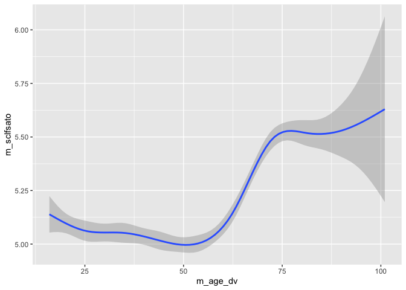

Week 8 class: Data types
================
2024-03-05

## Data types in R

### Vectors

#### Numeric vectors

Numeric vectors contain numbers.

``` r
x <- 1:5

y <- c(5, 17, 87, 145, -9, 0)

x * 2
```

    ## [1]  2  4  6  8 10

``` r
x + y
```

    ## Warning in x + y: longer object length is not a multiple of shorter object
    ## length

    ## [1]   6  19  90 149  -4   1

If you want to produce pdf files directly in R Markdown either install
Latex or the **tinytex** package.

Missing values in R are denoted as NA.

``` r
z <- c(1:5, NA, 6:10)
z
```

    ##  [1]  1  2  3  4  5 NA  6  7  8  9 10

``` r
w <- c(1:5, NaN, 6:10)
w
```

    ##  [1]   1   2   3   4   5 NaN   6   7   8   9  10

``` r
# When doing the analysis sometimes you need to explicitly exclude the missing values.

mean(z)
```

    ## [1] NA

``` r
mean(z, na.rm = TRUE)
```

    ## [1] 5.5

#### Logical vectors

``` r
# T is for True
# F is for False

x <- c(TRUE, TRUE, FALSE, FALSE)
x
```

    ## [1]  TRUE  TRUE FALSE FALSE

``` r
z > 3
```

    ##  [1] FALSE FALSE FALSE  TRUE  TRUE    NA  TRUE  TRUE  TRUE  TRUE  TRUE

``` r
TRUE == 1
```

    ## [1] TRUE

``` r
FALSE == 0
```

    ## [1] TRUE

``` r
mean(x)
```

    ## [1] 0.5

#### Character vectors

``` r
a <- c("James", "aads", "Julia")
a
```

    ## [1] "James" "aads"  "Julia"

``` r
a <- c("James", "aads", "Julia", NA)
a
```

    ## [1] "James" "aads"  "Julia" NA

``` r
a <- c("James", "aads", "Julia", NA, 1)
a
```

    ## [1] "James" "aads"  "Julia" NA      "1"

#### Checking type of the object

``` r
class(z)
```

    ## [1] "integer"

``` r
typeof(z)
```

    ## [1] "integer"

``` r
str(z)
```

    ##  int [1:11] 1 2 3 4 5 NA 6 7 8 9 ...

``` r
class(x)
```

    ## [1] "logical"

``` r
class(a)
```

    ## [1] "character"

#### Changing the type of vectors

``` r
x <- c("1", "2", "3", "a")
class(x)
```

    ## [1] "character"

``` r
as.numeric(x)
```

    ## Warning: NAs introduced by coercion

    ## [1]  1  2  3 NA

``` r
x <- as.numeric(x)
```

    ## Warning: NAs introduced by coercion

``` r
class(x)
```

    ## [1] "numeric"

``` r
x
```

    ## [1]  1  2  3 NA

``` r
as.character(x)
```

    ## [1] "1" "2" "3" NA

``` r
# Number of elements in a vector

length(a)
```

    ## [1] 5

### Data frames

``` r
df <- data.frame(name1 = 1:5, name2 = rep(TRUE, 5), name3 = letters[1:5])
df
```

    ##   name1 name2 name3
    ## 1     1  TRUE     a
    ## 2     2  TRUE     b
    ## 3     3  TRUE     c
    ## 4     4  TRUE     d
    ## 5     5  TRUE     e

``` r
colnames(df)
```

    ## [1] "name1" "name2" "name3"

``` r
rownames(df)
```

    ## [1] "1" "2" "3" "4" "5"

``` r
dim(df)
```

    ## [1] 5 3

``` r
class(df)
```

    ## [1] "data.frame"

``` r
# subsetting
df[1, 1]
```

    ## [1] 1

``` r
df[2, 1]
```

    ## [1] 2

``` r
df[1, 2]
```

    ## [1] TRUE

``` r
# tibble
library(tidyverse)
```

    ## ── Attaching core tidyverse packages ──────────────────────── tidyverse 2.0.0 ──
    ## ✔ dplyr     1.1.2     ✔ readr     2.1.4
    ## ✔ forcats   1.0.0     ✔ stringr   1.5.0
    ## ✔ ggplot2   3.4.2     ✔ tibble    3.2.1
    ## ✔ lubridate 1.9.2     ✔ tidyr     1.3.0
    ## ✔ purrr     1.0.1     
    ## ── Conflicts ────────────────────────────────────────── tidyverse_conflicts() ──
    ## ✖ dplyr::filter() masks stats::filter()
    ## ✖ dplyr::lag()    masks stats::lag()
    ## ℹ Use the conflicted package (<http://conflicted.r-lib.org/>) to force all conflicts to become errors

``` r
df <- tibble(df)
class(df)
```

    ## [1] "tbl_df"     "tbl"        "data.frame"

``` r
# accessing columns in a data frame
# name1: doesn't work
df$name1
```

    ## [1] 1 2 3 4 5

### Matrices

``` r
m <- matrix(1:9, nrow = 3)
m
```

    ##      [,1] [,2] [,3]
    ## [1,]    1    4    7
    ## [2,]    2    5    8
    ## [3,]    3    6    9

``` r
m[1:2, 1:2]
```

    ##      [,1] [,2]
    ## [1,]    1    4
    ## [2,]    2    5

``` r
class(m)
```

    ## [1] "matrix" "array"

### Lists

``` r
l1 <- list(x, y, z, w, a, df, m)
l1  
```

    ## [[1]]
    ## [1]  1  2  3 NA
    ## 
    ## [[2]]
    ## [1]   5  17  87 145  -9   0
    ## 
    ## [[3]]
    ##  [1]  1  2  3  4  5 NA  6  7  8  9 10
    ## 
    ## [[4]]
    ##  [1]   1   2   3   4   5 NaN   6   7   8   9  10
    ## 
    ## [[5]]
    ## [1] "James" "aads"  "Julia" NA      "1"    
    ## 
    ## [[6]]
    ## # A tibble: 5 × 3
    ##   name1 name2 name3
    ##   <int> <lgl> <chr>
    ## 1     1 TRUE  a    
    ## 2     2 TRUE  b    
    ## 3     3 TRUE  c    
    ## 4     4 TRUE  d    
    ## 5     5 TRUE  e    
    ## 
    ## [[7]]
    ##      [,1] [,2] [,3]
    ## [1,]    1    4    7
    ## [2,]    2    5    8
    ## [3,]    3    6    9

``` r
class(l1)
```

    ## [1] "list"

``` r
typeof(l1)
```

    ## [1] "list"

``` r
class(l1[1])
```

    ## [1] "list"

``` r
class(l1[[1]])
```

    ## [1] "numeric"

### Factors

``` r
sex <- c(1, 2, 2, 2, 1, 1, 2, 1)
class(sex)
```

    ## [1] "numeric"

``` r
# recode into character vector
sex_ch <- if_else(sex == 1, "man", "woman")
class(sex_ch)
```

    ## [1] "character"

``` r
sex_fc <- factor(sex_ch, levels = c("man", "woman"))
sex_fc
```

    ## [1] man   woman woman woman man   man   woman man  
    ## Levels: man woman

``` r
class(sex_fc)
```

    ## [1] "factor"

There are also dates and times, and that’s a separate data type – see
the textbook.

Exercise:

Open the m_indresp data file and regress life satisfaction on sex and
age. Interpret the results. Extract the coefficients from the model
object and save as a vector. Extract the R-squared.

``` r
library(vroom)
```

    ## 
    ## Attaching package: 'vroom'

    ## The following objects are masked from 'package:readr':
    ## 
    ##     as.col_spec, col_character, col_date, col_datetime, col_double,
    ##     col_factor, col_guess, col_integer, col_logical, col_number,
    ##     col_skip, col_time, cols, cols_condense, cols_only, date_names,
    ##     date_names_lang, date_names_langs, default_locale, fwf_cols,
    ##     fwf_empty, fwf_positions, fwf_widths, locale, output_column,
    ##     problems, spec

``` r
m_indresp <- vroom("UKDA-6614-tab/tab/ukhls/m_indresp.tab")
```

    ## Rows: 27998 Columns: 3431

    ## ── Column specification ────────────────────────────────────────────────────────
    ## Delimiter: "\t"
    ## dbl (3431): pidp, pid, m_hidp, m_pno, m_childpno, m_hhorig, m_memorig, m_psu...
    ## 
    ## ℹ Use `spec()` to retrieve the full column specification for this data.
    ## ℹ Specify the column types or set `show_col_types = FALSE` to quiet this message.

``` r
head(m_indresp)
```

    ## # A tibble: 6 × 3,431
    ##     pidp      pid    m_hidp m_pno m_childpno m_hhorig m_memorig m_psu m_strata
    ##    <dbl>    <dbl>     <dbl> <dbl>      <dbl>    <dbl>     <dbl> <dbl>    <dbl>
    ## 1  22445 10127798 276420024     1         -8        3         3     4        2
    ## 2  29925 10192697 617814024     1          3        3         3     6        2
    ## 3  76165 10689869 140413224     1         -8        3         3    19        6
    ## 4 280165 12430439 753480824     1         -8        3         3    67       15
    ## 5 469205 13857142 413841224     1         -8        3         3   106       25
    ## 6 599765 14757249 209943224     1         -8        3         3   130       33
    ## # ℹ 3,422 more variables: m_sampst <dbl>, m_month <dbl>, m_quarter <dbl>,
    ## #   m_ivfio <dbl>, m_ioutcome <dbl>, m_sex <dbl>, m_dvage <dbl>,
    ## #   m_birthy <dbl>, m_chkwebdoby <dbl>, m_chkrespweb1 <dbl>,
    ## #   m_chkrespweb5 <dbl>, m_chkrespweb2 <dbl>, m_chkrespweb3 <dbl>,
    ## #   m_chkrespweb4 <dbl>, m_chkwebtitle <dbl>, m_chkwebsex <dbl>,
    ## #   m_nchunder16 <dbl>, m_nch5to15 <dbl>, m_nch10to15 <dbl>, m_nch10 <dbl>,
    ## #   m_nunder16abs <dbl>, m_n1619abs <dbl>, m_nchresp <dbl>, …

``` r
m_indresp <- m_indresp |>
  select(pidp, m_sex_dv, m_age_dv, m_sclfsato)

m_indresp |>
  count(m_sex_dv)
```

    ## # A tibble: 4 × 2
    ##   m_sex_dv     n
    ##      <dbl> <int>
    ## 1       -9     1
    ## 2        0     1
    ## 3        1 12408
    ## 4        2 15588

``` r
m_indresp |>
  count(m_age_dv) |>
  print(n = Inf)
```

    ## # A tibble: 86 × 2
    ##    m_age_dv     n
    ##       <dbl> <int>
    ##  1       -9     1
    ##  2       16   276
    ##  3       17   326
    ##  4       18   363
    ##  5       19   298
    ##  6       20   381
    ##  7       21   348
    ##  8       22   354
    ##  9       23   325
    ## 10       24   338
    ## 11       25   335
    ## 12       26   338
    ## 13       27   358
    ## 14       28   374
    ## 15       29   368
    ## 16       30   322
    ## 17       31   343
    ## 18       32   323
    ## 19       33   335
    ## 20       34   317
    ## 21       35   303
    ## 22       36   341
    ## 23       37   376
    ## 24       38   386
    ## 25       39   380
    ## 26       40   403
    ## 27       41   454
    ## 28       42   430
    ## 29       43   432
    ## 30       44   456
    ## 31       45   392
    ## 32       46   415
    ## 33       47   479
    ## 34       48   486
    ## 35       49   482
    ## 36       50   499
    ## 37       51   558
    ## 38       52   512
    ## 39       53   557
    ## 40       54   552
    ## 41       55   527
    ## 42       56   558
    ## 43       57   517
    ## 44       58   513
    ## 45       59   537
    ## 46       60   525
    ## 47       61   545
    ## 48       62   495
    ## 49       63   509
    ## 50       64   492
    ## 51       65   440
    ## 52       66   457
    ## 53       67   443
    ## 54       68   472
    ## 55       69   398
    ## 56       70   432
    ## 57       71   394
    ## 58       72   429
    ## 59       73   456
    ## 60       74   462
    ## 61       75   430
    ## 62       76   369
    ## 63       77   311
    ## 64       78   269
    ## 65       79   272
    ## 66       80   227
    ## 67       81   188
    ## 68       82   171
    ## 69       83   154
    ## 70       84   128
    ## 71       85    97
    ## 72       86    91
    ## 73       87    76
    ## 74       88    65
    ## 75       89    60
    ## 76       90    51
    ## 77       91    36
    ## 78       92    26
    ## 79       93    27
    ## 80       94     8
    ## 81       95     9
    ## 82       96     6
    ## 83       97     4
    ## 84       98     4
    ## 85      100     1
    ## 86      101     1

``` r
m_indresp |>
  count(m_sclfsato) |>
  print(n = Inf)
```

    ## # A tibble: 12 × 2
    ##    m_sclfsato     n
    ##         <dbl> <int>
    ##  1         -9   105
    ##  2         -8   119
    ##  3         -7   104
    ##  4         -2   197
    ##  5         -1    62
    ##  6          1   489
    ##  7          2  1163
    ##  8          3  2295
    ##  9          4  3294
    ## 10          5  5481
    ## 11          6 11729
    ## 12          7  2960

``` r
m_indresp <- m_indresp |>
  mutate(m_sclfsato = if_else(m_sclfsato > 0, m_sclfsato, NA_real_)) |>
  mutate(m_age_dv = if_else(m_age_dv > 0, m_age_dv, NA_real_)) |>
  mutate(m_sex_dv = if_else(m_sex_dv > 0, m_sex_dv, NA_real_)) 

# or:
# m_indresp <- m_indresp |>
#    mutate(across(c(m_sclfsato, m_age_dv, m_sex_dv), ~ if_else(.x > 0, .x, NA_real_)))

model1 <- lm(m_sclfsato ~ m_sex_dv + m_age_dv + I(m_age_dv ^ 2), data = m_indresp)

model1
```

    ## 
    ## Call:
    ## lm(formula = m_sclfsato ~ m_sex_dv + m_age_dv + I(m_age_dv^2), 
    ##     data = m_indresp)
    ## 
    ## Coefficients:
    ##   (Intercept)       m_sex_dv       m_age_dv  I(m_age_dv^2)  
    ##     5.5691312     -0.0726878     -0.0234841      0.0003052

``` r
class(model1)
```

    ## [1] "lm"

``` r
typeof(model1)
```

    ## [1] "list"

``` r
str(model1)
```

    ## List of 13
    ##  $ coefficients : Named num [1:4] 5.569131 -0.072688 -0.023484 0.000305
    ##   ..- attr(*, "names")= chr [1:4] "(Intercept)" "m_sex_dv" "m_age_dv" "I(m_age_dv^2)"
    ##  $ residuals    : Named num [1:27408] 0.0262 0.0188 0.028 0.0243 1.011 ...
    ##   ..- attr(*, "names")= chr [1:27408] "1" "2" "3" "4" ...
    ##  $ effects      : Named num [1:27408] -853.86 6.41 22.06 18.14 1.01 ...
    ##   ..- attr(*, "names")= chr [1:27408] "(Intercept)" "m_sex_dv" "m_age_dv" "I(m_age_dv^2)" ...
    ##  $ rank         : int 4
    ##  $ fitted.values: Named num [1:27408] 4.97 4.98 4.97 4.98 4.99 ...
    ##   ..- attr(*, "names")= chr [1:27408] "1" "2" "3" "4" ...
    ##  $ assign       : int [1:4] 0 1 2 3
    ##  $ qr           :List of 5
    ##   ..$ qr   : num [1:27408, 1:4] -1.66e+02 6.04e-03 6.04e-03 6.04e-03 6.04e-03 ...
    ##   .. ..- attr(*, "dimnames")=List of 2
    ##   .. .. ..$ : chr [1:27408] "1" "2" "3" "4" ...
    ##   .. .. ..$ : chr [1:4] "(Intercept)" "m_sex_dv" "m_age_dv" "I(m_age_dv^2)"
    ##   .. ..- attr(*, "assign")= int [1:4] 0 1 2 3
    ##   ..$ qraux: num [1:4] 1.01 1.01 1 1
    ##   ..$ pivot: int [1:4] 1 2 3 4
    ##   ..$ tol  : num 1e-07
    ##   ..$ rank : int 4
    ##   ..- attr(*, "class")= chr "qr"
    ##  $ df.residual  : int 27404
    ##  $ na.action    : 'omit' Named int [1:590] 104 559 563 611 711 837 838 873 890 917 ...
    ##   ..- attr(*, "names")= chr [1:590] "104" "559" "563" "611" ...
    ##  $ xlevels      : Named list()
    ##  $ call         : language lm(formula = m_sclfsato ~ m_sex_dv + m_age_dv + I(m_age_dv^2), data = m_indresp)
    ##  $ terms        :Classes 'terms', 'formula'  language m_sclfsato ~ m_sex_dv + m_age_dv + I(m_age_dv^2)
    ##   .. ..- attr(*, "variables")= language list(m_sclfsato, m_sex_dv, m_age_dv, I(m_age_dv^2))
    ##   .. ..- attr(*, "factors")= int [1:4, 1:3] 0 1 0 0 0 0 1 0 0 0 ...
    ##   .. .. ..- attr(*, "dimnames")=List of 2
    ##   .. .. .. ..$ : chr [1:4] "m_sclfsato" "m_sex_dv" "m_age_dv" "I(m_age_dv^2)"
    ##   .. .. .. ..$ : chr [1:3] "m_sex_dv" "m_age_dv" "I(m_age_dv^2)"
    ##   .. ..- attr(*, "term.labels")= chr [1:3] "m_sex_dv" "m_age_dv" "I(m_age_dv^2)"
    ##   .. ..- attr(*, "order")= int [1:3] 1 1 1
    ##   .. ..- attr(*, "intercept")= int 1
    ##   .. ..- attr(*, "response")= int 1
    ##   .. ..- attr(*, ".Environment")=<environment: R_GlobalEnv> 
    ##   .. ..- attr(*, "predvars")= language list(m_sclfsato, m_sex_dv, m_age_dv, I(m_age_dv^2))
    ##   .. ..- attr(*, "dataClasses")= Named chr [1:4] "numeric" "numeric" "numeric" "numeric"
    ##   .. .. ..- attr(*, "names")= chr [1:4] "m_sclfsato" "m_sex_dv" "m_age_dv" "I(m_age_dv^2)"
    ##  $ model        :'data.frame':   27408 obs. of  4 variables:
    ##   ..$ m_sclfsato   : num [1:27408] 5 5 5 5 6 7 2 4 6 5 ...
    ##   ..$ m_sex_dv     : num [1:27408] 2 2 2 2 2 2 1 2 2 2 ...
    ##   ..$ m_age_dv     : num [1:27408] 36 44 38 42 31 34 36 55 32 85 ...
    ##   ..$ I(m_age_dv^2): 'AsIs' num [1:27408] 1296 1936 1444 1764  961 ...
    ##   ..- attr(*, "terms")=Classes 'terms', 'formula'  language m_sclfsato ~ m_sex_dv + m_age_dv + I(m_age_dv^2)
    ##   .. .. ..- attr(*, "variables")= language list(m_sclfsato, m_sex_dv, m_age_dv, I(m_age_dv^2))
    ##   .. .. ..- attr(*, "factors")= int [1:4, 1:3] 0 1 0 0 0 0 1 0 0 0 ...
    ##   .. .. .. ..- attr(*, "dimnames")=List of 2
    ##   .. .. .. .. ..$ : chr [1:4] "m_sclfsato" "m_sex_dv" "m_age_dv" "I(m_age_dv^2)"
    ##   .. .. .. .. ..$ : chr [1:3] "m_sex_dv" "m_age_dv" "I(m_age_dv^2)"
    ##   .. .. ..- attr(*, "term.labels")= chr [1:3] "m_sex_dv" "m_age_dv" "I(m_age_dv^2)"
    ##   .. .. ..- attr(*, "order")= int [1:3] 1 1 1
    ##   .. .. ..- attr(*, "intercept")= int 1
    ##   .. .. ..- attr(*, "response")= int 1
    ##   .. .. ..- attr(*, ".Environment")=<environment: R_GlobalEnv> 
    ##   .. .. ..- attr(*, "predvars")= language list(m_sclfsato, m_sex_dv, m_age_dv, I(m_age_dv^2))
    ##   .. .. ..- attr(*, "dataClasses")= Named chr [1:4] "numeric" "numeric" "numeric" "numeric"
    ##   .. .. .. ..- attr(*, "names")= chr [1:4] "m_sclfsato" "m_sex_dv" "m_age_dv" "I(m_age_dv^2)"
    ##   ..- attr(*, "na.action")= 'omit' Named int [1:590] 104 559 563 611 711 837 838 873 890 917 ...
    ##   .. ..- attr(*, "names")= chr [1:590] "104" "559" "563" "611" ...
    ##  - attr(*, "class")= chr "lm"

``` r
# Extract the coefficients
model1$coefficients
```

    ##   (Intercept)      m_sex_dv      m_age_dv I(m_age_dv^2) 
    ##  5.5691311691 -0.0726877930 -0.0234840562  0.0003051563

``` r
model1[1]
```

    ## $coefficients
    ##   (Intercept)      m_sex_dv      m_age_dv I(m_age_dv^2) 
    ##  5.5691311691 -0.0726877930 -0.0234840562  0.0003051563

``` r
model1[[1]]
```

    ##   (Intercept)      m_sex_dv      m_age_dv I(m_age_dv^2) 
    ##  5.5691311691 -0.0726877930 -0.0234840562  0.0003051563

``` r
# Extract R-squared

str(summary(model1))
```

    ## List of 12
    ##  $ call         : language lm(formula = m_sclfsato ~ m_sex_dv + m_age_dv + I(m_age_dv^2), data = m_indresp)
    ##  $ terms        :Classes 'terms', 'formula'  language m_sclfsato ~ m_sex_dv + m_age_dv + I(m_age_dv^2)
    ##   .. ..- attr(*, "variables")= language list(m_sclfsato, m_sex_dv, m_age_dv, I(m_age_dv^2))
    ##   .. ..- attr(*, "factors")= int [1:4, 1:3] 0 1 0 0 0 0 1 0 0 0 ...
    ##   .. .. ..- attr(*, "dimnames")=List of 2
    ##   .. .. .. ..$ : chr [1:4] "m_sclfsato" "m_sex_dv" "m_age_dv" "I(m_age_dv^2)"
    ##   .. .. .. ..$ : chr [1:3] "m_sex_dv" "m_age_dv" "I(m_age_dv^2)"
    ##   .. ..- attr(*, "term.labels")= chr [1:3] "m_sex_dv" "m_age_dv" "I(m_age_dv^2)"
    ##   .. ..- attr(*, "order")= int [1:3] 1 1 1
    ##   .. ..- attr(*, "intercept")= int 1
    ##   .. ..- attr(*, "response")= int 1
    ##   .. ..- attr(*, ".Environment")=<environment: R_GlobalEnv> 
    ##   .. ..- attr(*, "predvars")= language list(m_sclfsato, m_sex_dv, m_age_dv, I(m_age_dv^2))
    ##   .. ..- attr(*, "dataClasses")= Named chr [1:4] "numeric" "numeric" "numeric" "numeric"
    ##   .. .. ..- attr(*, "names")= chr [1:4] "m_sclfsato" "m_sex_dv" "m_age_dv" "I(m_age_dv^2)"
    ##  $ residuals    : Named num [1:27408] 0.0262 0.0188 0.028 0.0243 1.011 ...
    ##   ..- attr(*, "names")= chr [1:27408] "1" "2" "3" "4" ...
    ##  $ coefficients : num [1:4, 1:4] 5.569131 -0.072688 -0.023484 0.000305 0.062226 ...
    ##   ..- attr(*, "dimnames")=List of 2
    ##   .. ..$ : chr [1:4] "(Intercept)" "m_sex_dv" "m_age_dv" "I(m_age_dv^2)"
    ##   .. ..$ : chr [1:4] "Estimate" "Std. Error" "t value" "Pr(>|t|)"
    ##  $ aliased      : Named logi [1:4] FALSE FALSE FALSE FALSE
    ##   ..- attr(*, "names")= chr [1:4] "(Intercept)" "m_sex_dv" "m_age_dv" "I(m_age_dv^2)"
    ##  $ sigma        : num 1.39
    ##  $ df           : int [1:3] 4 27404 4
    ##  $ r.squared    : num 0.016
    ##  $ adj.r.squared: num 0.0159
    ##  $ fstatistic   : Named num [1:3] 148 3 27404
    ##   ..- attr(*, "names")= chr [1:3] "value" "numdf" "dendf"
    ##  $ cov.unscaled : num [1:4, 1:4] 2.01e-03 -2.32e-04 -6.71e-05 6.14e-07 -2.32e-04 ...
    ##   ..- attr(*, "dimnames")=List of 2
    ##   .. ..$ : chr [1:4] "(Intercept)" "m_sex_dv" "m_age_dv" "I(m_age_dv^2)"
    ##   .. ..$ : chr [1:4] "(Intercept)" "m_sex_dv" "m_age_dv" "I(m_age_dv^2)"
    ##  $ na.action    : 'omit' Named int [1:590] 104 559 563 611 711 837 838 873 890 917 ...
    ##   ..- attr(*, "names")= chr [1:590] "104" "559" "563" "611" ...
    ##  - attr(*, "class")= chr "summary.lm"

``` r
summary(model1)$r.squared
```

    ## [1] 0.01596927

``` r
summary(model1)[[8]]
```

    ## [1] 0.01596927

``` r
# m_indresp |>
#   mutate(across(m_sex_dv:m_sclfsato, if_else(. > 0, ., NA_real_)))
#     
```

2.  Recode age into age groups. Convert age into a factor, with “16-35”
    as the reference category. Regress life satisfaction on sex and age
    groups again. What changed in the interpretation.

``` r
m_indresp <- m_indresp |>
  mutate(m_age_gr = case_when(
    m_age_dv %in% 16:34 ~ "16-34",
    m_age_dv %in% 35:59 ~ "35-59",
    m_age_dv >= 60  ~ ">=60"
  )) |>
  mutate(m_age_gr = factor(m_age_gr, levels = c(">=60", "16-34", "35-59")))

model2 <- lm(m_sclfsato ~ m_sex_dv + m_age_gr, data = m_indresp)
summary(model2)
```

    ## 
    ## Call:
    ## lm(formula = m_sclfsato ~ m_sex_dv + m_age_gr, data = m_indresp)
    ## 
    ## Residuals:
    ##     Min      1Q  Median      3Q     Max 
    ## -4.4084 -0.9878  0.5916  0.9384  2.0122 
    ## 
    ## Coefficients:
    ##               Estimate Std. Error t value Pr(>|t|)    
    ## (Intercept)    5.48224    0.02969 184.657  < 2e-16 ***
    ## m_sex_dv      -0.07388    0.01690  -4.371 1.24e-05 ***
    ## m_age_gr16-34 -0.29198    0.02246 -13.001  < 2e-16 ***
    ## m_age_gr35-59 -0.34672    0.01916 -18.097  < 2e-16 ***
    ## ---
    ## Signif. codes:  0 '***' 0.001 '**' 0.01 '*' 0.05 '.' 0.1 ' ' 1
    ## 
    ## Residual standard error: 1.39 on 27404 degrees of freedom
    ##   (590 observations deleted due to missingness)
    ## Multiple R-squared:  0.01358,    Adjusted R-squared:  0.01347 
    ## F-statistic: 125.8 on 3 and 27404 DF,  p-value: < 2.2e-16

``` r
m_indresp  <- m_indresp |>
  mutate(m_age_gr = fct_relevel(m_age_gr, "16-34", "35-59"))

lm(m_sclfsato ~ m_sex_dv + m_age_gr, data = m_indresp) |>
  summary()
```

    ## 
    ## Call:
    ## lm(formula = m_sclfsato ~ m_sex_dv + m_age_gr, data = m_indresp)
    ## 
    ## Residuals:
    ##     Min      1Q  Median      3Q     Max 
    ## -4.4084 -0.9878  0.5916  0.9384  2.0122 
    ## 
    ## Coefficients:
    ##               Estimate Std. Error t value Pr(>|t|)    
    ## (Intercept)    5.19026    0.03177 163.393  < 2e-16 ***
    ## m_sex_dv      -0.07388    0.01690  -4.371 1.24e-05 ***
    ## m_age_gr35-59 -0.05474    0.02189  -2.500   0.0124 *  
    ## m_age_gr>=60   0.29198    0.02246  13.001  < 2e-16 ***
    ## ---
    ## Signif. codes:  0 '***' 0.001 '**' 0.01 '*' 0.05 '.' 0.1 ' ' 1
    ## 
    ## Residual standard error: 1.39 on 27404 degrees of freedom
    ##   (590 observations deleted due to missingness)
    ## Multiple R-squared:  0.01358,    Adjusted R-squared:  0.01347 
    ## F-statistic: 125.8 on 3 and 27404 DF,  p-value: < 2.2e-16

How life satisfaction depends on age

``` r
m_indresp |>
  ggplot(aes(x = m_age_dv, y = m_sclfsato)) +
  geom_smooth()
```

    ## `geom_smooth()` using method = 'gam' and formula = 'y ~ s(x, bs = "cs")'

    ## Warning: Removed 588 rows containing non-finite values (`stat_smooth()`).

<!-- -->

For week 9: read the Data import chapter from the R for Data Science
textbook: <https://r4ds.hadley.nz/import>
